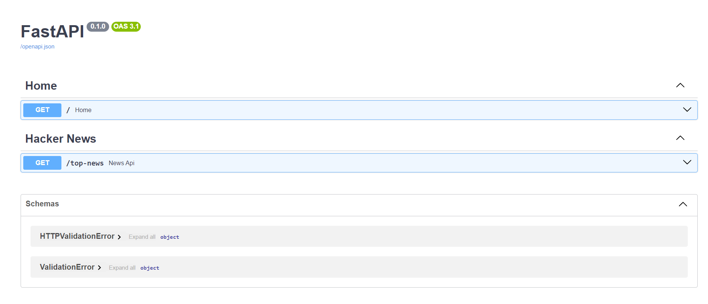
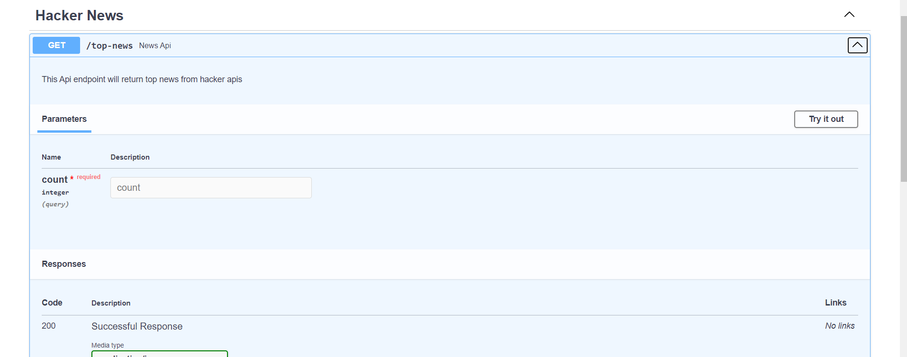

FastAPI Application for Fetching Top News from Hacker News API
Local Setup
1. **Clone the repository**:
   - Start by cloning the repository to your local machine.
2. **Create a Python virtual environment**:
   - Ensure you have Python 3.12.0 installed.
   - Create a virtual environment using the following command:
     ```bash
     python -m venv venv
     ```
3. **Install Poetry**:
   - Install Poetry, the dependency manager, using pip:
     ```bash
     pip install poetry
     ```
4. **Install project dependencies**:
   - Navigate to the project directory and install the dependencies using Poetry:
     ```bash
     poetry install
     ```
5. **Create a .env file**:
   - In the project directory, create a `.env` file and set the following variables:
     ```bash
     HACKER_NEWS_API_URL="https://hacker-news.firebaseio.com/v0/"
     REDIS_HOST="redis-host"
     REDIS_PORT=xxxx
     REDIS_PASSWORD="xxxxxxx"
     REDIS_EXP_TIME=xxxx
     ```
6. **Run the application**:
   - To start the FastAPI application, use the following command:
     ```bash
     poetry run api
     ```
7. **Access the API documentation**:
   - Open your browser and go to:
     ```
     http://localhost:5000/docs
     ```
   - You can now interact with the API endpoints through the interactive documentation.
8. **Run locally using Docker**:
   - After installing dependencies, create the distribution files:
     ```bash
     poetry build
     ```
   - Then, create a Docker image:
     ```bash
     docker build -t news-api .
     ```
   - Run the Docker image:
     ```bash
     docker run -p 5000:5000 news-api
     ```
9. **Access the API documentation**:
   - Open your browser and go to:
     ```
     http://localhost:5000/docs
     ```
   - You can now interact with the API endpoints through the interactive documentation.
10. **Test the API Endpoints**:
   - There are two routes:
     - `/` (home route)
       
     - `/top-news` (for fetching top news)
       
   - Click on "Try it out," pass the query parameter `count`, and you'll receive the response.
